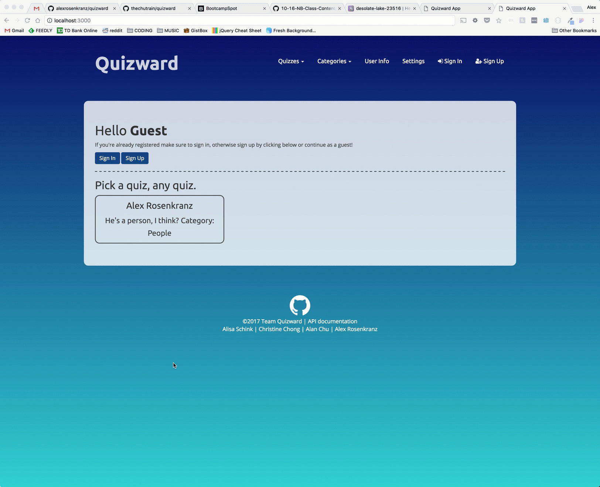
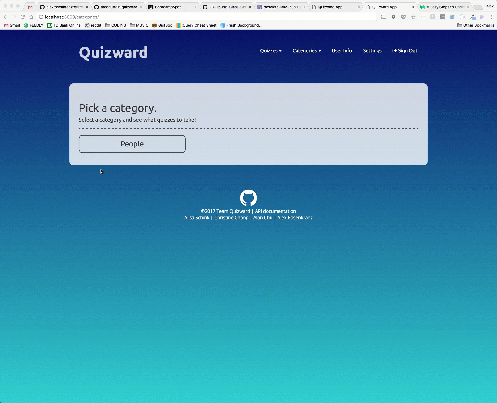

# Quizward
> a public quizing application built in Node, Express, MySQL, HTML, CSS and JavaScript

## Contributors
* **Alex Rosenkranz** [github](https://github.com/alexrosenkranz)
* **Alan Chu** [github](https://github.com/thechutrain)
* **Alisa Schick** [github](https://github.com/alisaschink)
* **Christine Chong** [github](https://github.com/ccho0415)


## Synopsis
This idea came from our very own **Alisa Shink's** experience with being a tutor. What if you could make quizzes for people on the fly and allow people to take them and see how they did? What if you could create an account so you can keep track of how well you've done on quizzes you've taken over time? If a question leaves you stumped, don't you want to be able to create a conversation around it and get clarification from your peers or the person that created the quiz? Well with **_Quizward_**, you can do just that. 

Let **_Quizward_** keep track of all things "quiz" in your life.

## Technologies Used
### Back End
- MySQL
- Sequelize
- Node.js
- Express
- Passport.js
- Multer

### Front End
- HTML
- CSS
- JavaScript
- jQuery
- AJAX
- Handlebars
- Bootstrap Framework
- Moment.js


## ERD


## Quizward In Action






## Quick start

### In order to run a local copy / development version, please make a config/config.json file in the root directory:

*Make sure to also create a database called 'quizward_db' as well.
```json
{
  "development": {
    "username": YOUR_USERNAME,
    "password": YOUR_PASSWORD,
    "database": "quizward_db",
    "host": "127.0.0.1",
    "dialect": "mysql"
  }
}
```

### If you have nodemon installed globablly, you can run the app with:
``` shell
$ npm start
```

